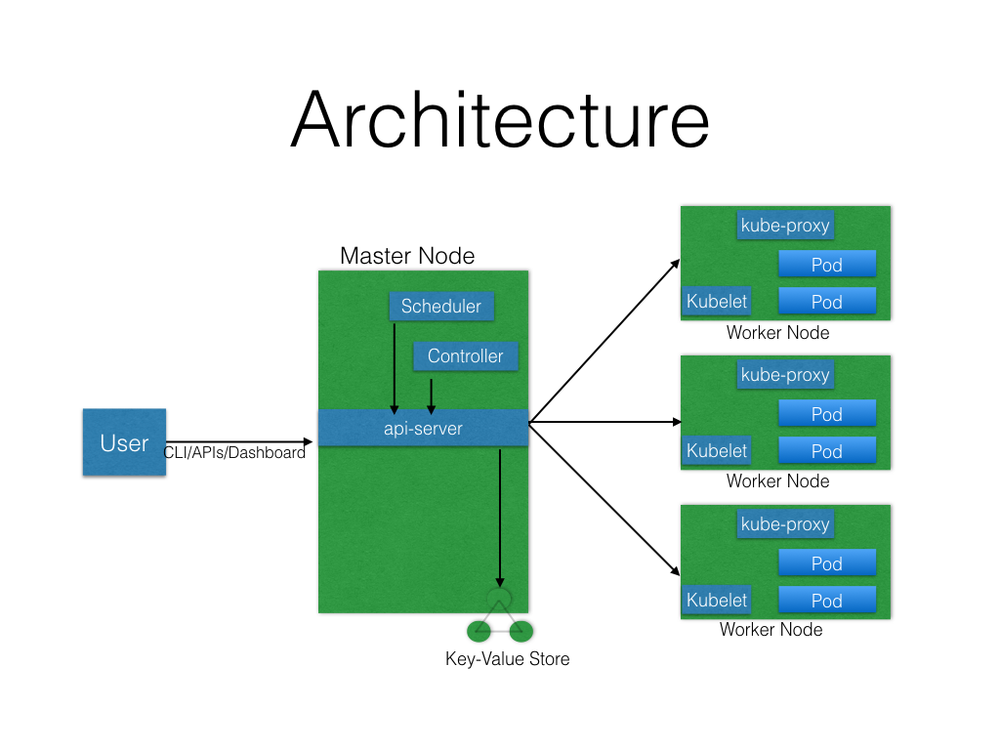
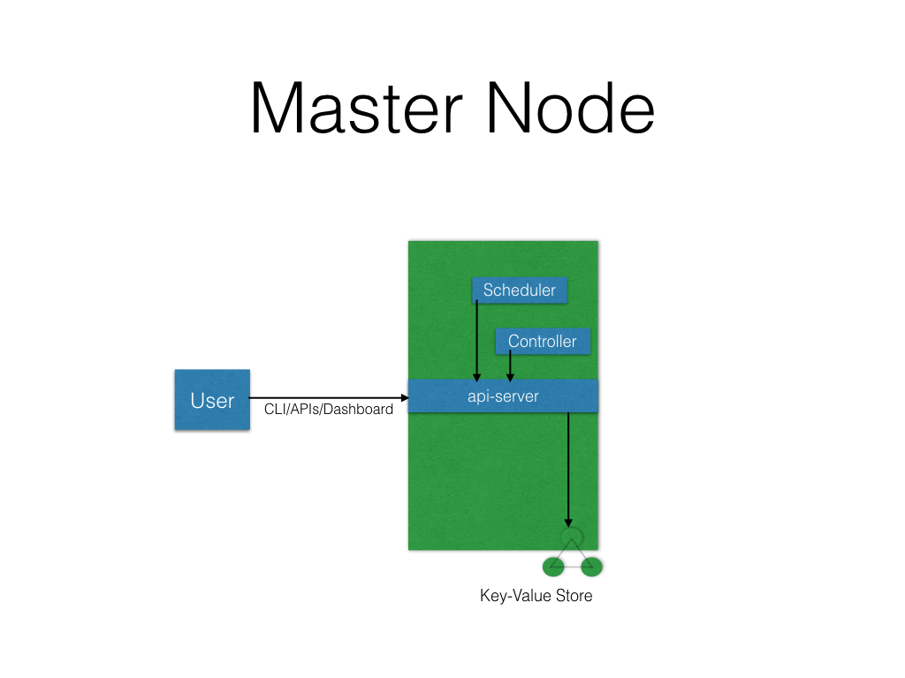
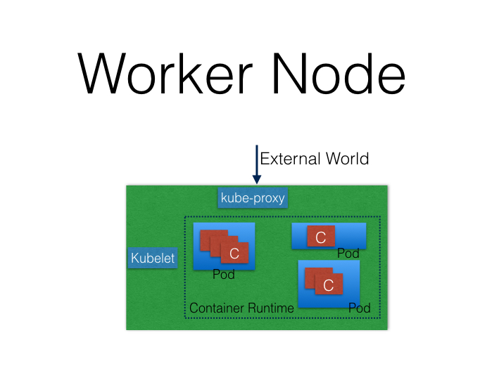
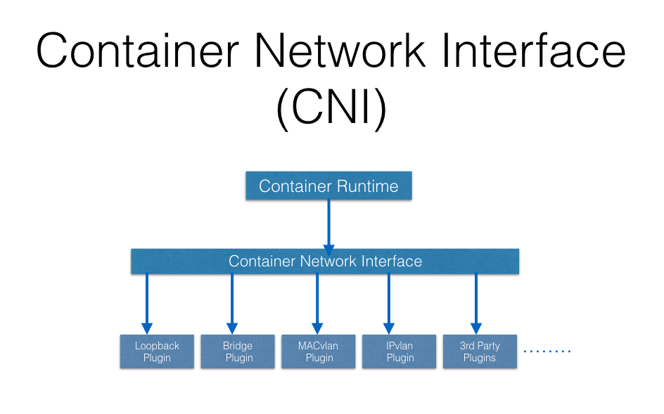

# Kubernetes Architecture

At a very high level, Kubernetes has the following main components:

- One or more Master Nodes
- One or more Worker Nodes
- Distributed Key-value store, like etcd

## Master Node

The Master Node is responsible for managing the Kubernetes cluster, and it is the entry point for all administrative tasks. We can communicate to the Master node via the CLI, the GUI (Dashboard), or via APIs.

For fault tolerance purposes, there can be more than one Master Node in the cluster. If we have more than one Master Node, they would be in a HA (High Availability) mode, and only one of them will be the leader, performing all the operations. The rest of the Master Nodes would be followers.

To manage the cluster state, Kubernetes uses etcd, and all Master Nodes connect to it. etcd is a distributed key-value store, which we will discuss in a little bit. The key-value store can be part of the Master Node. It can also be configured externally, in which case, the Master Nodes would connect to it.

## Master Node Components

A Master Node has the following components:

### API Server

All the administrative tasks are performed via the API Server within the Master Node. A user/operator sends REST commands to the API Server, which then validates and processes the requests. After executing the requests, the resulting state of the cluster is stored in the distributed key-value store.

### Scheduler

As the name suggests, the Scheduler schedules the work to different Worker Nodes. The Scheduler has **the resource usage information for each Worker Node**. It also knows about the constraints that users/operators may have set, such as scheduling work on a node that has the label disk==ssd set. Before scheduling the work, the Scheduler also takes into account the quality of the service requirements, data locality, affinity, anti-affinity, etc. The Scheduler schedules the work in terms of Pods and Services.

### Controller Manager

The Controller Manager manages different non-terminating control loops, which regulate the state of the Kubernetes cluster. Each one of these control loops knows about the desired state of the objects it manages, and watches their current state through the API Server. In a control loop, if the current state of the objects it manages does not meet the desired state, then the control loop takes corrective steps to make sure that the current state is the same as the desired state.

### etcd

**etcd** is a distributed key-value store which is used to store the cluster state. It can be part of the Kubernetes Master, or, it can be configured externally, in which case, Master Nodes would connect to it.

## Worker Node

A Worker Node is a machine (VM, physical server, etc.) which runs the applications using Pods and is controlled by the Master Node. Pods are scheduled on the Worker Nodes, which have the necessary tools to run and connect them. A Pod is the scheduling unit in Kubernetes. It is a logical collection of one or more containers which are always scheduled together. We will explore them further in later chapters.

To access the applications from the external world, we connect to Worker Nodes and not to the Master Node/s.

## Worker Node Components

A Worker Node has the following components:

### Container Runtime

To run containers, we need a Container Runtime on the Worker Node. By default, Kubernetes is configured to run containers with Docker. It can also run containers using the rkt Container Runtime.

### kubelet

The kubelet is an agent which runs on each Worker Node and communicates with the Master Node. It receives the Pod definition via various means (primarily, through the API Server), and runs the containers associated with the Pod. It also makes sure the containers which are part of the Pods are healthy at all times.
The kubelet connects with the Container Runtimes to run containers. Currently, the kubelet and Container Runtimes are tightly coupled. There is work in progress for the Container Runtime Interface (CRI) to have a pluggable CRI in the near future.

### kube-proxy

Instead of connecting directly to Pods to access the applications, we use a logical construct called a Service as a connection endpoint. A Service groups related Pods, which it load balances when accessed.
**kube-proxy** is the network proxy which runs on each Worker Node and listens to the API Server for each Service endpoint creation/deletion. For each Service endpoint, kube-proxy sets up the routes so that it can reach to it.

## State Management with etcd

Kubernetes uses etcd to store the cluster state. etcd is a distributed key-value store based on the Raft Consensus Algorithm. Raft allows a collection of machines to work as a coherent group that can survive the failures of some of its members. At any given time, one of the nodes in the group will be the Master, and the rest of them will be the Followers. Any node can be treated as a Master.

**etcd** is written in the **Go programming language**. In Kubernetes, besides storing the cluster state, etcd is also used to store configuration details such as subnets, ConfigMaps, Secrets, etc.

## Network Setup Challenges

To have a fully functional Kubernetes cluster, we need to make sure of the following:

- A unique IP is assigned to each Pod
- Containers in a Pod can communicate to each other
- The Pod is able to communicate with other Pods in the cluster
- If configured, the application deployed inside a Pod is accessible from the external world.

All of the above are networking challenges which must be addressed before deploying the Kubernetes cluster.

## Assigning a Unique IP Address to Each Pod

In Kubernetes, each Pod gets a unique IP address. For container networking, there are two primary specifications:

- Container Network Model (CNM), proposed by Docker
- Container Network Interface (CNI), proposed by CoreOS.

Kubernetes uses CNI to assign the IP address to each Pod.

The Container Runtime offloads the IP assignment to CNI, which connects to the underlying configured plugin, like Bridge or MACvlan, to get the IP address. Once the IP address is given by the respective plugin, CNI forwards it back to the requested Container Runtime.

## Container-to-Container Communication Inside a Pod

With the help of the underlying Host OS, all of the Container Runtimes generally create an isolated network entity for each container that it starts. On Linux, that entity is referred to as a Network Namespace. These Network Namespaces can be shared across containers, or with the Host Operating System

**Inside a Pod, containers share the Network Namespaces, so that they can reach to each other via localhost**.

## Pod-to-Pod Communication Across Nodes

In a clustered environment, the Pods can be scheduled on any node. We need to make sure that the Pods can communicate across the nodes, and all the nodes should be able to reach any Pod. Kubernetes also puts a condition that there shouldn't be any Network Address Translation (NAT) while doing the Pod-to-Pod communication across Hosts. We can achieve this via:

- Routable Pods and nodes, using the underlying physical infrastructure, like Google Container Engine
- Using Software Defined Networking, like Flannel, Weave, Calico, etc.

## Communication Between the External World and Pods

By exposing our services to the external world with kube-proxy, we can access our applications from outside the cluster.

## [Goback...](./index.md)